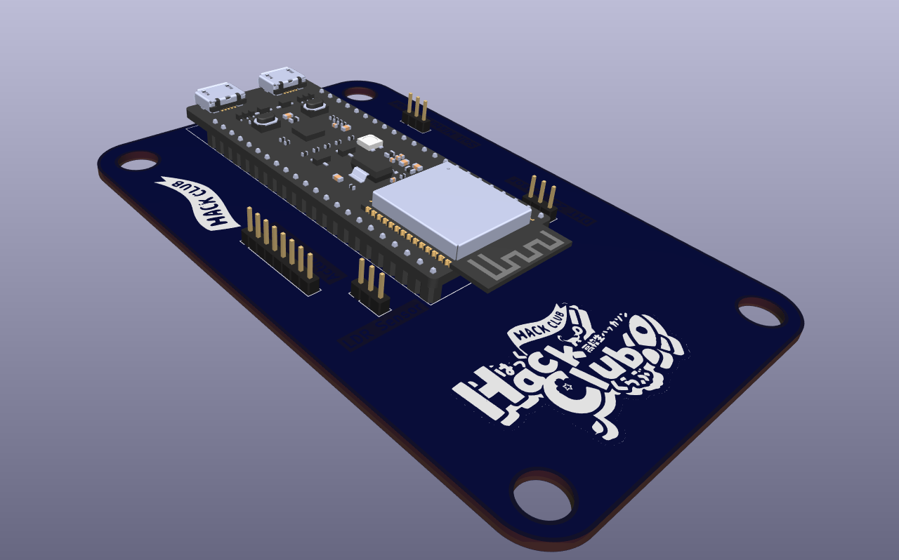
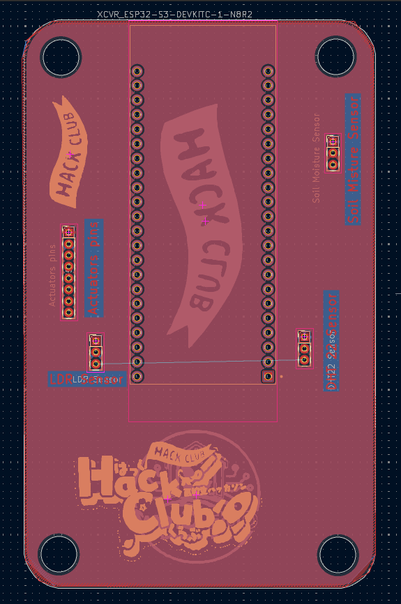
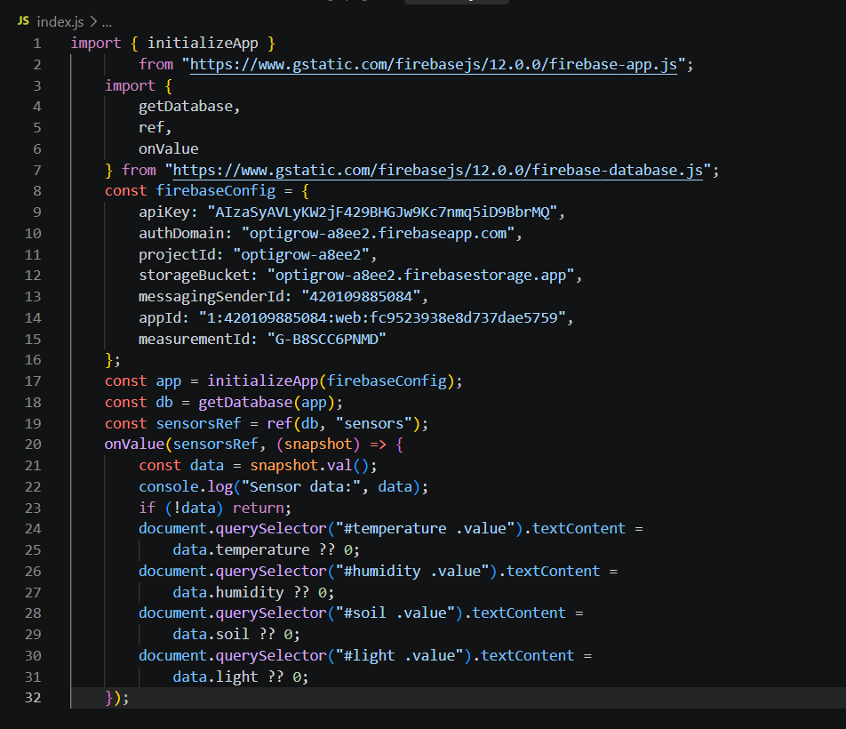
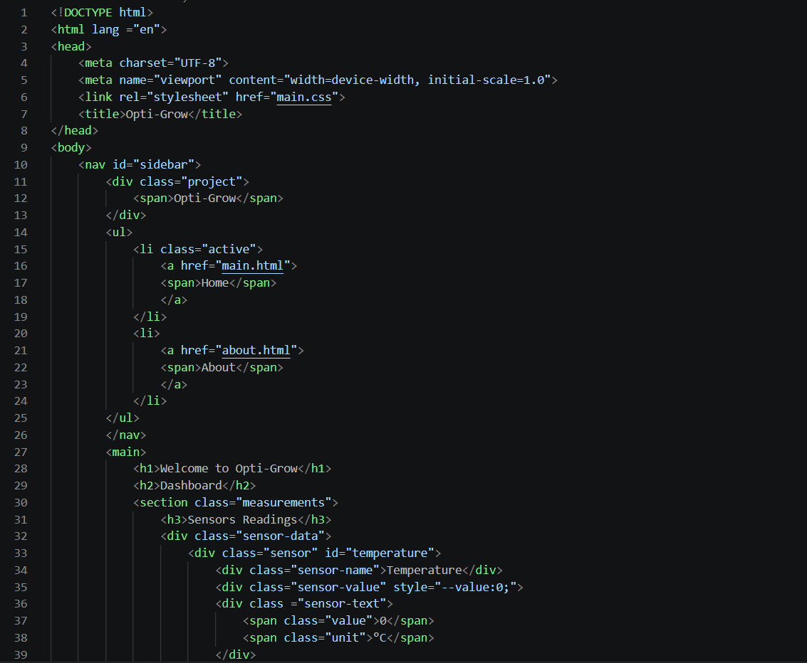

# Opti-Grow

## Description 
Optic-grow is an closed-loop feedback system.A system that monitors and act based on lavendar & lettuce coditions in Wadi el natroun , Egypt.It handle plants temperature , Humidty & soil moisture and lighht intesity,preserving plant between optiman conditions high and low point.As it use actuctors,peltiers,humidifier , heatinglamp ,grow ligth ,  water pump and fan.It powered by esp s3.and cloud base storage of firebase,show data at moment on web app.

## Why it was built
This Grade 11 Capstone Project in STEM October School,part of our GPA system.It is about the challenge Egypt faces in intergrating IOT closed Systems with farming.Our Project solve this by providing high nutrition needed crop in Wadi el notroun all the year.Lavendar & lettuce controlled by feedback system.that control temperature & Humidty & soil moisture & light intensity parameter.

## How to use it / Build it
Firstly,Buying all electronics parts,then buy and cuts wood into blocks ,by using CNC machine for actuators.After that,assemble all together using nails and wood glue.hen adding electronic compontes sesnor & actucators.and connect them first to power supply to test it.then connect each one alone first to esp ,then test them all.after that,check wire isolation and system working and real data from sesnors.test system manul for 2 h. Finally, add plants and soil.

## Schematic 

We  made symbols & footprints for missing parts in kicad,then wires them ,and add pin headers instead of wire sensor direct to pcb,finally,organize schematic and adding flow diagram of system feedback.

## PCB 
pcb consist of pinheaders and will connect to sensors using isolated wires & jumpers,and actuctors will connect to relayes .we made pcb on kicad,body outline first,the routed componets together.

## CAD
we assembled greenhouse on fusion and make enclosure for pcb ,power supply & buck. 

## Firmware 
I made esp code and web to monitor data form firebase,but i will add js part later during building

### WEB

 

 

### ESP 

## BOM

 we made the BOM and needed materials ,in egypt then convert its price to USD dollar.

