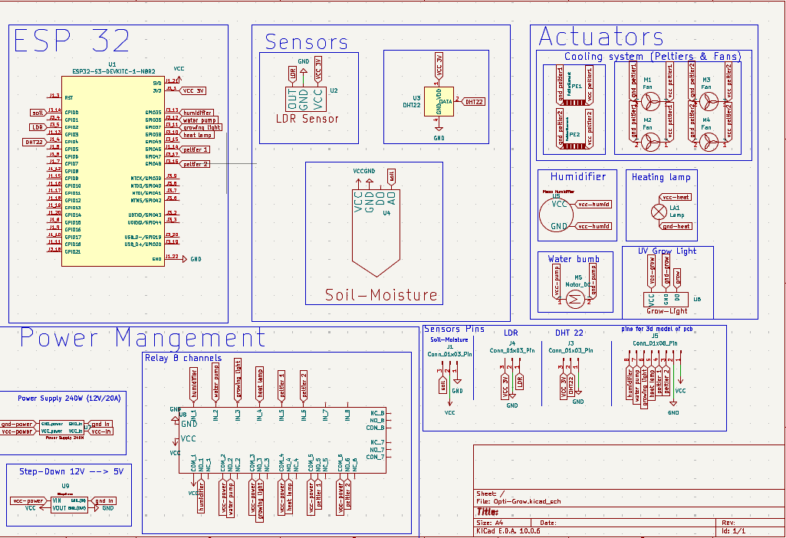

# Opti-Grow

## Description 
Optic-grow is an closed-loop feedback system.A system that monitors and act based on lavendar & lettuce coditions in Wadi el natroun , Egypt.It handle plants temperature , Humidty & soil moisture and lighht intesity,preserving plant between optiman conditions high and low point.As it use actuctors,peltiers,humidifier , heatinglamp ,grow ligth ,  water pump and fan.It powered by esp s3.and cloud base storage of firebase,show data at moment on web app.

## Why it was built

## How to use it / Build it

## Schematic 

## PCB 

## CAD

## Firmware 

## BOM

 I made the BOM and needed materials ,in egypt then convert its price to USD dollar.

