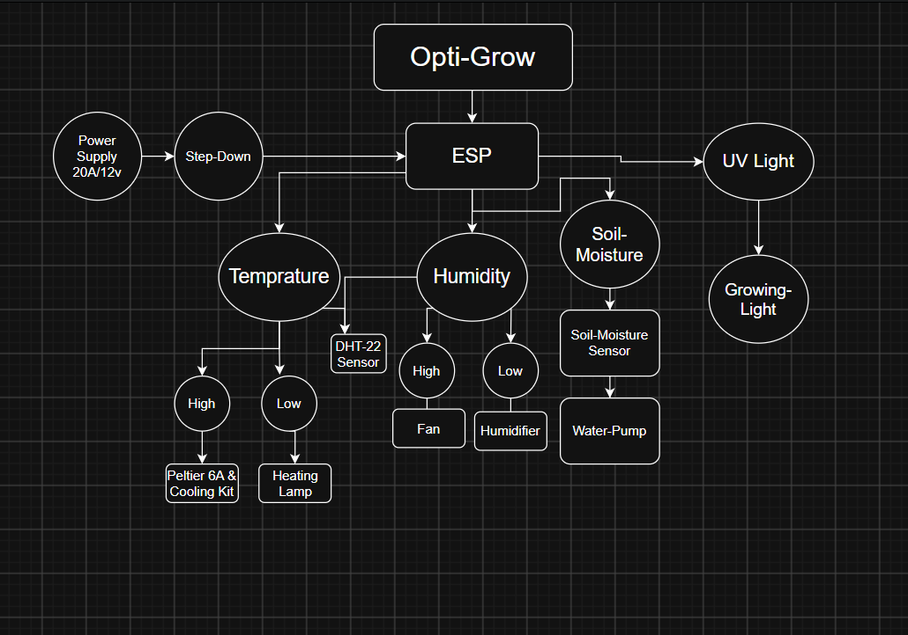
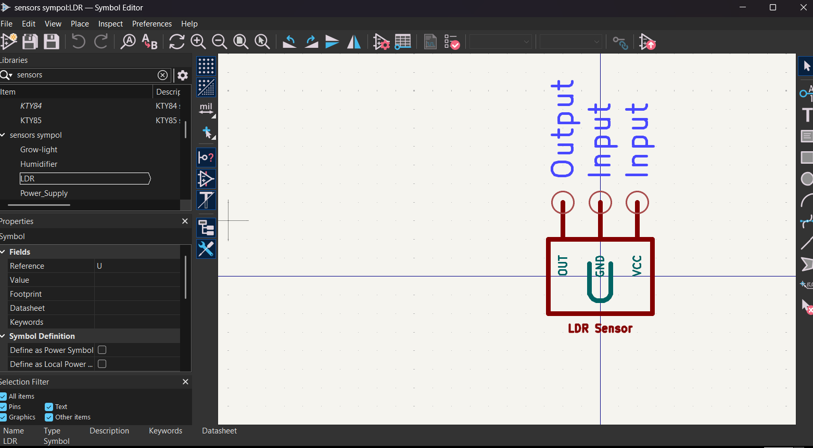
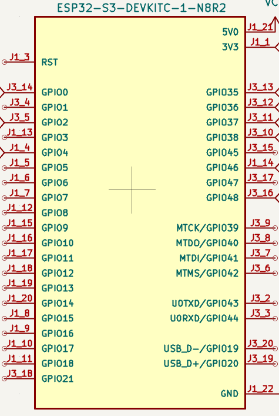
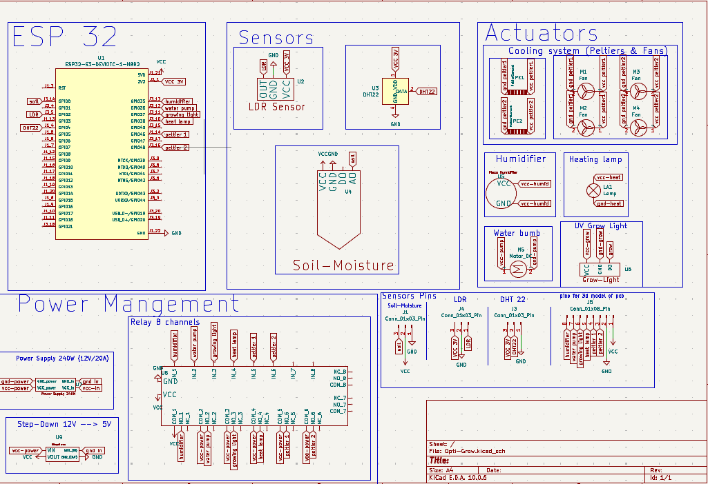
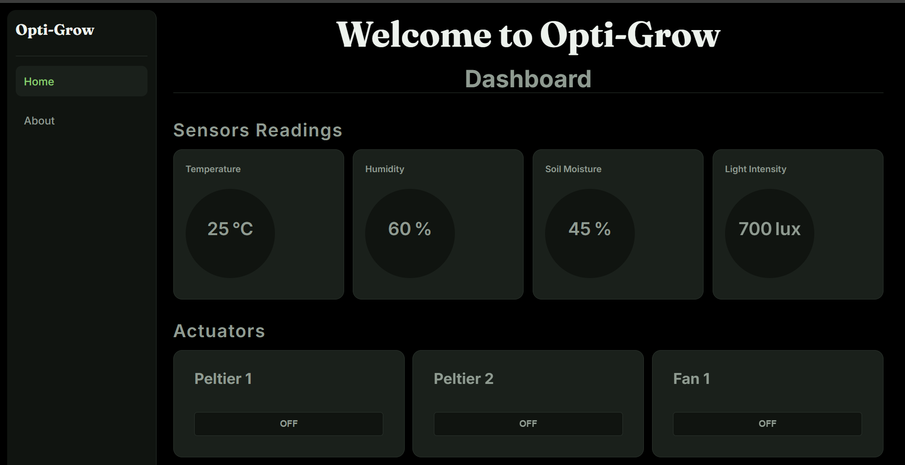
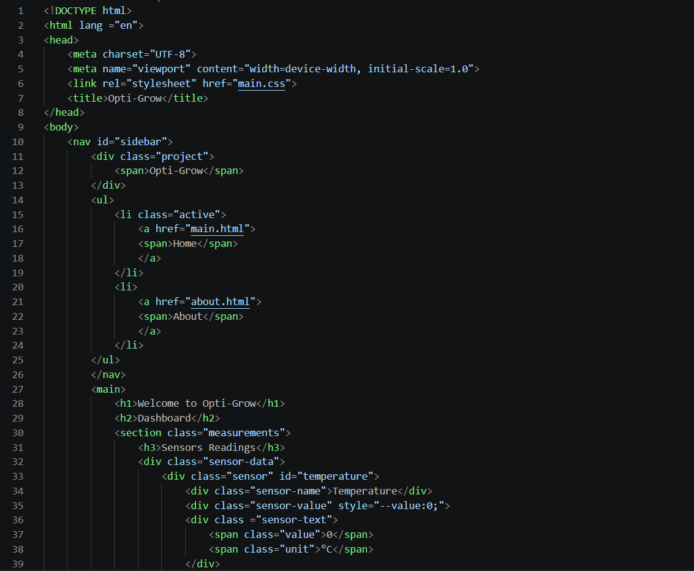
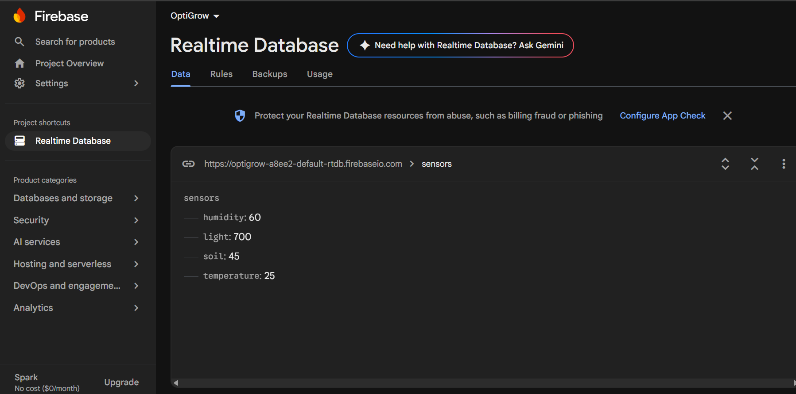
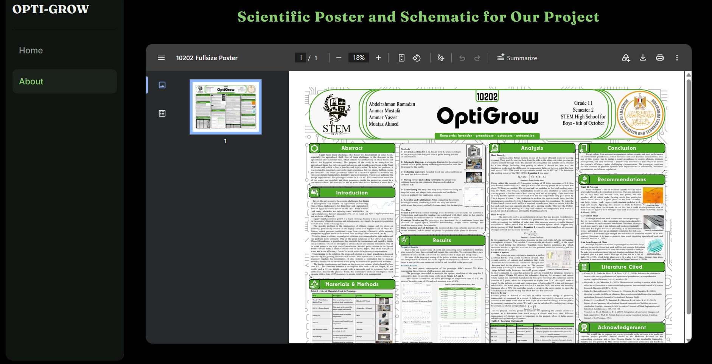

# Opti-Grow
> **Contributors:**
> - 
> - 

---
## Day 1 

- **total hours spent:** 1.1 hours

### Entry:

oooh, it is my first time to make a hardware project in my hackclub journey, and it is my first time to work with my friend.

soooo, it was kinda cool and wierd at the same time tbh, we learnt how to use github repo together.

also, i learnt how can i make my first journal and how can i make it color coded with the entry's writer.
soooo, i think it will be amazing and easy for the reviewer to review our work.

Now, i will start to say what i did in these hours.

i started a zoom meeting with my teammate youssef and We divided the work equally among ourselves. I took on the process flowchart for the project.

Also, i prepare for the schematic design. sooo, I designed some components that are not available in KiCad, such as the power supply, LDR sensor, soil moisture sensor,humidifier, and 8-channel relay.

soooo, that's all for day 1.

## Recording links:
- https://lapse.hackclub.com/timelapse/ogyNfzCJSMm7
- https://lapse.hackclub.com/timelapse/OxvIdBLA7l52

-----------------------------------

## Day 2 

- **Total hours spent:** 3.5 hours

### Entry:

yaaaaaaay!!!!, it is my second day, and It was the longest and most enjoyable day for me at the Hack Club, because I learnt a skill I had really wanted to acquire --> schematic design which is the foundation of any hardware project.

first, i searched about the correct connectu=ions and the pins of all sensors and the name of the ESP pins.

second, i started to make the schematic design for the first time and checking the connections by searching for along time.

third, i turned the schematic design to simple pcb to help my friend to make the 3d design.

soooo, i searched about the suitable footprints i will need and finally i designed the pcb by amazing hack cub stickers, arrrrrr!

## Recorded link:
- https://lapse.hackclub.com/timelapse/oBFSV6Mf2WTm

-------------------------------------

## before starting the hardware process

- **making the website:** approx 5 hours.

- so, before starting the hardware part in my team. i made the website to display data from the ESP module and conducted a test run using dummy data.

          

Also, i integrated it with Firebase for the trial.

 I also created an "About" page featuring the project's scientific poster detailing the concept, components, and connections to physics and chemistry principles.

